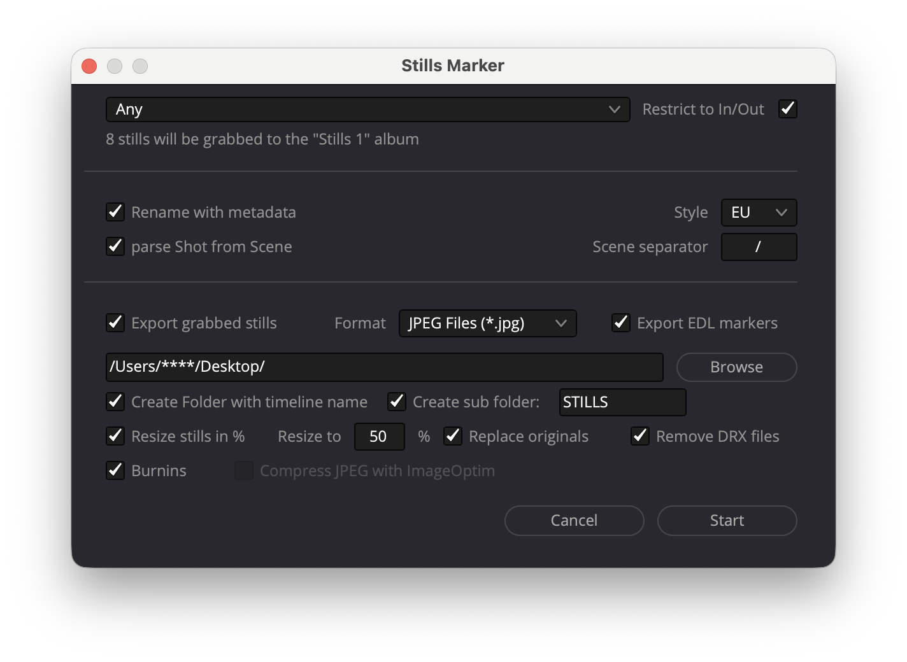

# Resolve Stills Markers Exporter

        

## Overview

Resolve Stills Markers Exporter is a DaVinci Resolve Workflow Integration plugin that allows you to:

- Grab stills from timeline markers
- Export stills to disk
- Rename stills using clip metadata
- Apply customizable burn-ins via JSON layout
- Apply cinematic blanking (aspect ratio mask: bars, frame, or both)
- Export marker-based EDL files
- Remove DRX files automatically
- Optionally compress exported images
- Export burn-in presets as Resolve-compatible XML
- Import and browse existing Resolve burn-in presets
- Push presets directly into Resolve

---

## Requirements

- DaVinci Resolve 18 or higher
- Python 3.6 or higher
- Pillow (Python Imaging Library)

The script attempts to install Pillow automatically if not found.

---

## Pillow Installation

### macOS

1. In Resolve: Workspace → Console → Py3 tab
2. Run:

```python
import sys
print(sys.version)
```

3. In Terminal:

```bash
python3 -m ensurepip --upgrade
python3 -m pip install --upgrade pip
python3 -m pip install --upgrade Pillow
```

Replace `python3` with your actual version if required.

---

### Windows

```bash
py -m ensurepip --upgrade
py -m pip install --upgrade pip
py -m pip install --upgrade Pillow
```

---

## Installation in DaVinci Resolve

Copy the script into the Workflow Integration Plugins folder and restart Resolve.

macOS:
```
/Library/Application Support/Blackmagic Design/DaVinci Resolve/Workflow Integration Plugins/
```

Windows:
```
%PROGRAMDATA%\Blackmagic Design\DaVinci Resolve\Support\Workflow Integration Plugins\
```

Launch from:

Workspace → Workflow Integration

---

## Burn-In Web Editor


The plugin includes a web-based burn-in layout editor with:

- Drag & drop burn-in elements
- Magnetic snapping during drag (Shift to disable)
- Font size (pt), family, weight, color, opacity
- Background opacity per element
- Custom template builder using metadata tokens
- Token search and favorites panel
- Cinematic blanking preview
- Safe guides preview
- Direct JSON save
- Undo (Cmd/Ctrl+Z) and Redo (Cmd/Ctrl+Y)
- Save shortcut (Cmd/Ctrl+S)
- Delete selected token (Delete / Backspace)
- Move selected token with arrow keys (1% step)

Configuration file:

```
Stills_Marker_python_settings/burnin_web_settings.json
```

---

## JSON Server

Start the local JSON server from the plugin folder:

```bash
cd /Library/Application\ Support/Blackmagic\ Design/DaVinci\ Resolve/Workflow\ Integration\ Plugins/Stills_Marker_python_settings
python3 server_save_burnin_json.py
```

---

## DaVinci Resolve Interoperability

### Import presets from Resolve

The editor reads `SlatePresetList.xml` from the Resolve project library and displays all existing burn-in presets. You can browse and load them as a reference.

### Export to XML

Generates a Resolve-compatible `FontRenderItemVec` XML file ready to import in Resolve (Burn In → Import).

The exported file is named `<preset name> Burn In.xml` following Resolve's own naming convention.

Elements mapped to Resolve auto-fill types (Record TC, Source TC, Scene, Take, Shot, Camera, Good Take, Reel Name, etc.) are exported as native Resolve types. Custom text elements are mapped to Resolve's Custom Text1/2/3 slots (maximum 3 per preset).

### Send to Resolve

Send the preset directly to Resolve without leaving the editor. Resolve picks up the preset on restart.

---

## Magnetic Snapping

When dragging elements on the canvas, they automatically snap to:

- Safe zone axes (standard horizontal and vertical guides)
- Other elements' positions

A blue guide line is drawn on the axis being snapped to.
Hold **Shift** while dragging to disable snapping temporarily.

---

## Metadata Tokens

The editor exposes the full DaVinci Resolve metadata dictionary. Tokens are grouped into categories and can be searched by name. A favorites row gives quick access to the most common tokens.

### Favorites (always visible)

```
%Timeline         %Clipname         %Camera_#
%Scene            %Shot             %Take
%Start_TC         %End_TC           %Shoot_Day
%ISO              %White_Balance    %Date
%Reel_Name        %Resolution       %FPS
%Source_TC        %Good_Take        %Video_Codec
%Source_Resolution %File_Name       %Duration
```

### File / Clip

```
%File_Name        %Clip_Directory   %Video_Codec
%Start_TC         %End_TC           %Duration
%Start_Frame      %End_Frame        %Frames
%FPS              %Resolution       %Data_Level
%Audio_Channels   %Date_Modified    %KeyKode
%Clipname         %Reel_Name        %File_Path
%Usage            %Clip_Type        %Clip_#
%In               %Out              %Version
%Group            %Drop_Frame       %Has_Keyframes
%EDL_Clip_Name    %Subclip
```

### Scene / Shot / Production

```
%Scene            %Shot             %Take
%Angle            %Good_Take        %Shoot_Day
%Date_Recorded    %Roll_Card        %Comments
%Program_Name     %Episode_#        %Episode_Name
%Shot_During_Ep   %Location         %Unit_Name
%Setup            %Day_Night        %Environment
%Shot_Type        %Format           %Safe_Area
%Timelapse_Interval %People         %Category
%Subcategory      %Keywords         %Move
```

### Camera

```
%Camera_#         %Camera_Type      %Camera_Serial
%Camera_ID        %Camera_Notes     %Camera_Format
%FPS              %TC_Type          %Camera_Firmware
%Camera_Manufacturer %Camera_Position
%Camera_Pan_Angle %Camera_Tilt_Angle %Camera_Roll_Angle
%Shutter_Angle    %Shutter_Type     %ISO
%White_Balance    %White_Balance_Tint %Sensor
%Sensor_Area      %Media_Type       %Monitor_Color_Space
%Monitor_LUT      %LUT_Used         %LUT_Used_On_Set
%RAW              %H_Flip           %V_Flip
```

### Lens

```
%Lens_Type        %Lens_#           %Lens_Notes
%Aperture         %Aperture_Type    %Focal_Length
%Distance         %Filter           %ND_Filter
%PAR_Notes        %Asp_Ratio_Notes  %Gamma_Notes
%Color_Space_Notes
```

### Post / Color

```
%LUT1             %LUT2             %LUT3
%Lab_Roll         %Colorist_Notes   %CDL_SOP
%CDL_SAT          %IDT              %Input_LUT
%Input_Color_Space %Input_Sizing_Preset %Input_Sizing
%Edit_Sizing      %Slate_TC         %Graded
%HDR_Graded       %Noise_Reduction  %Proxy_Clip
%Fusion_Composition %Magic_Mask     %Codec_Bitrate
%Render_Resolution %Compression_Ratio
```

### 3D / Stereo

```
%S3D_Shot         %S3D_Eye          %S3D_Notes
%S3D_Sync         %IA               %FG
%CV               %BG               %Convergence_Adj
%3D_Rig_Type      %3D_Rig_ID        %Rig_Inverted
%Eye
```

### VFX

```
%VFX_Shot         %VFX_Markers      %VFX_Notes
%Framing_Chart    %Color_Chart      %Grey_Chart
%Lens_Chart       %VFX_Grey_Ball    %VFX_Mirror_Ball
```

### Audio

```
%Audio_Recorder   %Deck_Serial      %Deck_Firmware
%Audio_Notes      %Embedded_Audio   %Audio_File_Type
%Audio_Media      %Sound_Roll       %Audio_TC_Type
%Audio_Start_TC   %Audio_End_TC     %Audio_Dur_TC
%Sample_Rate      %Audio_Sample_Rate %Audio_FPS
%Audio_Bit_Depth  %Audio_Offset     %Bit_Rate
%Tone             %FSD
%Track_1 … %Track_24
```

### Custom template syntax

Any combination of tokens and free text is supported:

```
%Scene / %Shot - %Take %Camera_#
```

If `Good_Take = "1"`, the token renders as `*`.

---

## Cinematic Blanking

Supported ratios:

```
1.33 (4/3)
1.66
1.77 (16:9, default)
1.85
2.00
2.35
2.39
2.40
```

Mask styles:

- Bars
- Frame
- Bars + Frame

Mask opacity is respected during export.

---

## Export Pipeline

1. Grab still
2. Export to disk
3. Load with Pillow
4. Apply blanking mask
5. Render burn-ins from JSON
6. Save final image
7. Optional compression (not working)

---

## Core Features

- Metadata-driven renaming
- JSON-based burn-in layout
- Custom template engine with mixed tokens and text
- Automatic star for Good_Take
- Full Resolve metadata token support (130+ tokens)
- Token search and favorites
- Cinematic blanking
- Per-element font, color, opacity, and background opacity
- Magnetic snapping with visual guides (Shift to disable)
- Undo (Cmd/Ctrl+Z) and Redo (Cmd/Ctrl+Y)
- Save shortcut (Cmd/Ctrl+S)
- Delete selected token (Delete / Backspace)
- Move selected token with arrow keys (0.1% step)
- Export burn-in preset as Resolve XML
- Import/browse existing Resolve presets
- Push preset directly into Resolve's SlatePresetList.xml
- Remove .drx files
- Resize exported stills
- Restrict grab between In/Out
- Marker-based EDL export
- Optional ImageOptim compression

---

## Known Limitations

- Resolve does not allow GUI locking during script execution. Opening modal windows or automatic backups during execution may cause failures.
- Resolve supports a maximum of 3 Custom Text slots per burn-in preset. Elements that do not map to a Resolve native type count toward this limit.
- Send to Resolve : Resolve must be restarted or the project re-opened to pick up the change.

---

Designed for professional post-production workflows requiring structured, metadata-driven still exports with customizable burn-ins.