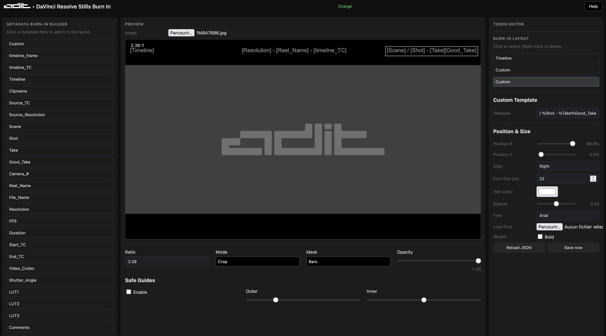

# Resolve Stills Markers Exporter

## Overview

Resolve Stills Markers Exporter is a DaVinci Resolve Workflow Integration plugin that allows you to:

- Grab stills from timeline markers
- Export stills to disk
- Rename stills using clip metadata
- Apply customizable burn-ins via JSON layout
- Apply cinematic blanking (aspect ratio mask: bars, frame, or both)
- Export marker-based EDL files
- Remove DRX files automatically
- Optionally compress exported images

Originally converted to Python from a Lua script created by Roger Magnusson. This version extends the tool with a web-based burn-in editor and a metadata-driven rendering pipeline.

---

## Requirements

- DaVinci Resolve 18 or higher
- Python 3.6 or higher
- Pillow (Python Imaging Library)

The script attempts to install Pillow automatically if not found.

---

## Pillow Installation

### macOS

1. In Resolve: Workspace → Console → Py3 tab
2. Run:

```python
import sys
print(sys.version)
```

3. In Terminal:

```bash
python3 -m ensurepip --upgrade
python3 -m pip install --upgrade pip
python3 -m pip install --upgrade Pillow
```

Replace `python3` with your actual version if required.

---

### Windows

```bash
py -m ensurepip --upgrade
py -m pip install --upgrade pip
py -m pip install --upgrade Pillow
```

---

## Installation in DaVinci Resolve

Copy the script into the Workflow Integration Plugins folder and restart Resolve.

macOS:
```
/Library/Application Support/Blackmagic Design/DaVinci Resolve/Workflow Integration Plugins/
```

Windows:
```
%PROGRAMDATA%\Blackmagic Design\DaVinci Resolve\Support\Workflow Integration Plugins\
```

Launch from:

Workspace → Workflow Integration

---

## Burn-In Web Editor



The plugin includes a web-based burn-in layout editor with:

- Drag & drop burn-in elements
- Font size (pt), family, weight, color, opacity
- Custom template builder using metadata tokens
- Cinematic blanking preview
- Safe guides preview
- Direct JSON save

Configuration file:

```
Stills_Marker_python_settings/burnin_web_settings.json
```

---

## JSON Server

Start the local JSON server from the plugin folder:

```bash
cd /Library/Application\ Support/Blackmagic\ Design/DaVinci\ Resolve/Workflow\ Integration\ Plugins/Stills_Marker_python_settings
python3 server_save_burnin_json.py
```

---

## Metadata Tokens

Any metadata available in the exported JSON can be used:

```
%Scene
%Shot
%Take
%Good_Take
%Resolution
%Reel_Name
%timeline_TC
%Clipname
%Timeline
% ...
```

If `Good_Take = "1"`, it renders as `*`.

Example custom template:

```
%Scene / %Shot - %Take %Good_Take
```

---

## Cinematic Blanking

Supported ratios:

```
1.33 (4/3)
1.66
1.77 (16:9, default)
1.85
2.00
2.35
2.39
2.40
```

Mask styles:

- Bars
- Frame
- Bars + Frame

Mask opacity is respected during export.

---

## Export Pipeline

1. Grab still
2. Export to disk
3. Load with Pillow
4. Apply blanking mask
5. Render burn-ins from JSON
6. Save final image
7. Optional compression (not working)

---

## Core Features

- Metadata-driven renaming
- JSON-based burn-in layout
- Custom template engine
- Automatic star for Good_Take
- Timeline token support
- Cinematic blanking
- Per-element font, color and opacity
- Undo (Cmd/Ctrl + Z)
- Save shortcut (Cmd/Ctrl + S)
- Remove .drx files
- Resize exported stills
- Restrict grab between In/Out
- Marker-based EDL export
- Optional ImageOptim compression

---

## Known Limitations

Resolve does not allow GUI locking during script execution. Opening modal windows or automatic backups during execution may cause failures.

---

Designed for professional post-production workflows requiring structured, metadata-driven still exports with customizable burn-ins.